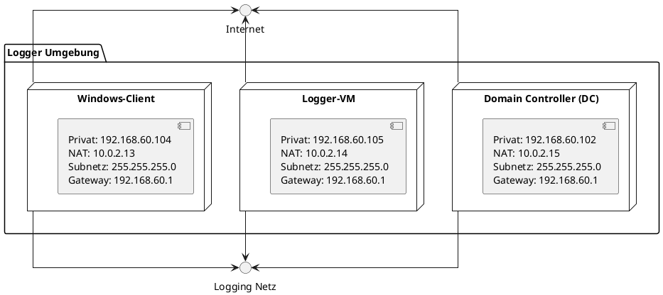

# Infrastruktur-Dokumentation: Detection-LAB

## Netzwerk-Diagramm

| VM              | IP-Adresse (privat) | IP-Adresse (NAT) | Subnetzmaske    | Gateway        |
|------------------|---------------------|------------------|-----------------|----------------|
| **Domain Controller (DC)** | 192.168.60.102 | 10.0.2.15        | 255.255.255.0   | 192.168.60.1   |
| **Logger-VM**   | 192.168.60.105      | 10.0.2.14        | 255.255.255.0   | 192.168.60.1   |
| **Windows-Client** | 192.168.60.104   | 10.0.2.13        | 255.255.255.0   | 192.168.60.1   |

**Hinweis:** Jede VM besitzt zwei Netzwerkadapter:
1. **Privates Netzwerk (192.168.60.0/24):** Ermöglicht die Kommunikation zwischen den VMs.
2. **NAT-Netzwerk (10.0.2.0):** Ermöglicht den Zugriff auf das Internet.

---

## Beschreibung der VMs

### Domain Controller (DC)
- **Host Name:** `DC`
- **Login-Daten:**
  - Benutzername: `vagrant`
  - Passwort: `vagrant`
- **Installierte Dienste:**
  - Active Directory (AD)
  - Windows Server 2019
- **Zugriffsmöglichkeiten:**
  - Kibana GUI: `http://192.168.60.105:5601`
  - Server Manager: -
- **Technische Details (Meine Config):**
  - **RAM:** 3072 MB
  - **CPU:** 2 Cores
  - **Netzwerk:** 1 Gbit/s Ethernet
  - **Speicher:** 36.29 GB frei (NTFS)

---

### Logger-VM
- **Host Name:** `logger`
- **Login-Daten:**
  - Benutzername: `vagrant`
  - Passwort: `vagrant`
- **Installierte Software:**
  - Elasticsearch, Kibana, Logstash (ELK-Stack)
- **Zugriffsmöglichkeiten:**
  - Kibana GUI: `http://192.168.60.105:5601`
  - SSH-Verbindung über `192.168.60.105`.
- **Technische Details (Meine Config):**
  - **RAM:** 4096 MB
  - **CPU:** 2 Cores
  - **Netzwerk:** 1 Gbit/s Ethernet
  - **Speicher:** 59.66 GB frei (NTFS)

---

### Windows-Client
- **Host Name:** `WIN11`
- **Login-Daten:**
  - Benutzername: `vagrant`
  - Passwort: **nicht definiert**
- **Installierte Software:**
  - OSQuery
  - Sysinternals Suite
- **Zugriffsmöglichkeiten:**
  - Kibana GUI: `http://192.168.60.105:5601`
- **Technische Details (Meine Config):**
  - **RAM:** 2048 MB
  - **CPU:** 2 Cores
  - **Netzwerk:** 1 Gbit/s Ethernet
  - **Speicher:** 38.31 GB frei (NTFS)

---

## Infrastruktur-Setup

### Vagrantfile: Sinn und Zweck
Das `Vagrantfile` dient als zentrale Konfigurationsdatei, um die Infrastruktur automatisiert aufzubauen. Es enthält Definitionen für:
1. **Virtuelle Maschinen**: Konfiguration der VM-Ressourcen (RAM, CPUs).
2. **Netzwerkeinstellungen**: Statische IP-Adressen und Gateways.
3. **Provisioning**: Automatische Installation und Konfiguration mit Skripten.

### Provisioning-Skripte
Die Skripte automatisieren die Installation und Konfiguration der Dienste:
- **`bootstrap.sh`**: Basisinstallation von Softwarepaketen und Netzwerkkonfiguration.
- **`ELK.sh`**: Installation des ELK-Stacks (Elasticsearch, Kibana, Logstash) auf der Logger-VM.

### Beschreibung der Skripte
#### `bootstrap.sh`
- Konfiguriert grundlegende Netzwerkparameter (DNS, IP).
- Installiert essentielle Pakete wie `curl` und `wget`.

#### `ELK.sh`
- Installiert Elasticsearch, Kibana und Beats-Module.
- Aktiviert Sicherheitsfunktionen wie Authentifizierung und API-Keys.
- Konfiguriert tägliche Log-Bereinigung mit Curator.

---

## Netzwerkkonnektivität

1. **Interne Kommunikation:**
   - Die VMs können sich gegenseitig pingen über das private Netzwerk (192.168.60.0/24). Dies wurde erfolgreich getestet.
2. **Internetverbindung:**
   - Über den NAT-Adapter mit der IP `10.0.2.15` haben alle VMs Zugriff auf das Internet. Diese Verbindung wird für Updates und Paketinstallationen genutzt.

---

